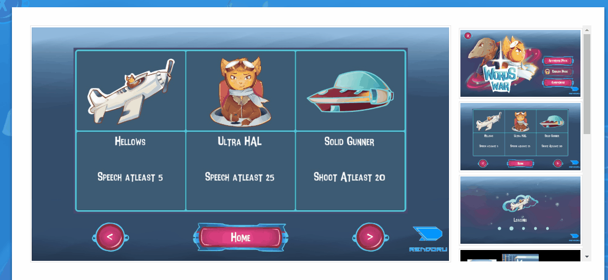

# Assignment 0 : Bad UI Design Examples

## 1. Etalasemuslim.com
Etalasemuslim is an online shop that sells various herbal medicines.\
actually there is no problem with the UI design of this website when viewed from a PC, although this website design style looks old-fashioned

\
the main problem is that this website is not responsive or not mobile-friendly if it is opened through a smarthphone. Visitors find it difficult to explore this website.\

Video : [Etalasemuslim](https://youtu.be/NNJ8Ja9m_5U)

## 2. Rendoru.com
rendoru.com is a personal website owned by my friend named Firman Maulana. This website contains blog posts and products that he has made. This time, we will review the product page. 

In my opinion, this page has several problem with the UI design, namely :
- The display of the showcase is somewhat confusing (see the GIF image), we have to scroll up and down to see the picture in detail.
- there is less neat typography\

- there is a back button that is less useful, because we can go back to the product listing page via the link in the main menu\

**Suggestion** :
- reduce height and add a scrollbar to the element that wraps the thumbnail\

- it seems better like this, look more professional\

- it's better if the back button is replaced with the next and previous button to immediately see other products\

## 3. Sample
Test

> Irman Kurniawan \
> 05111640000032 \
> HCI A 2019 
